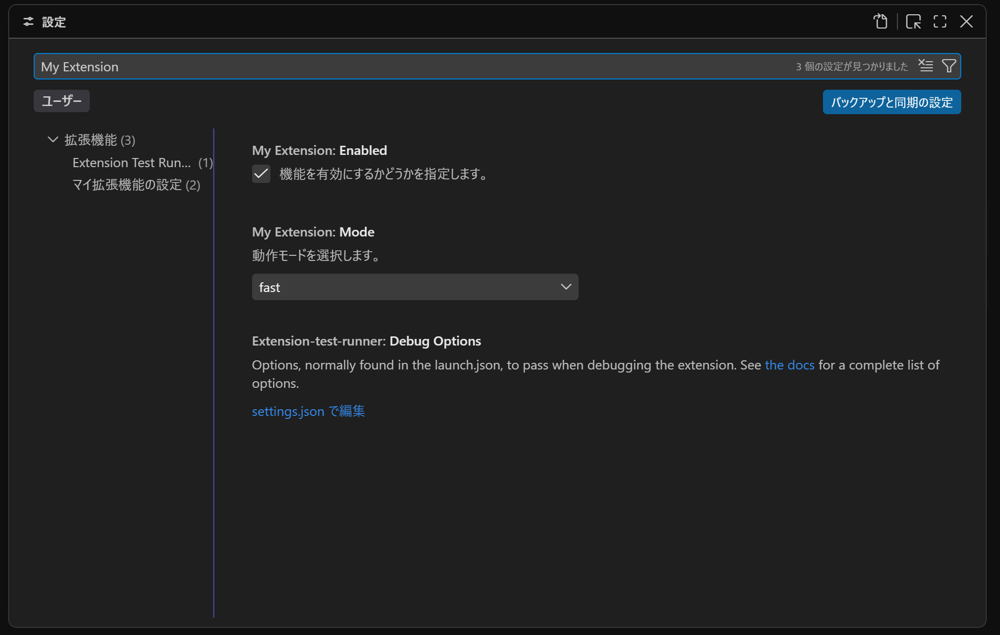
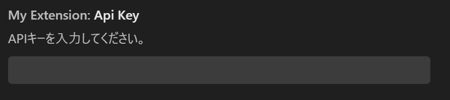
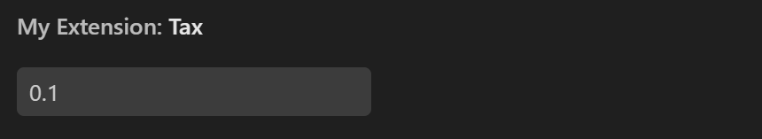
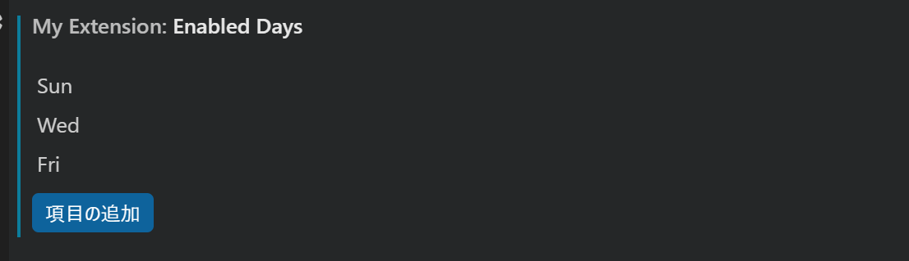
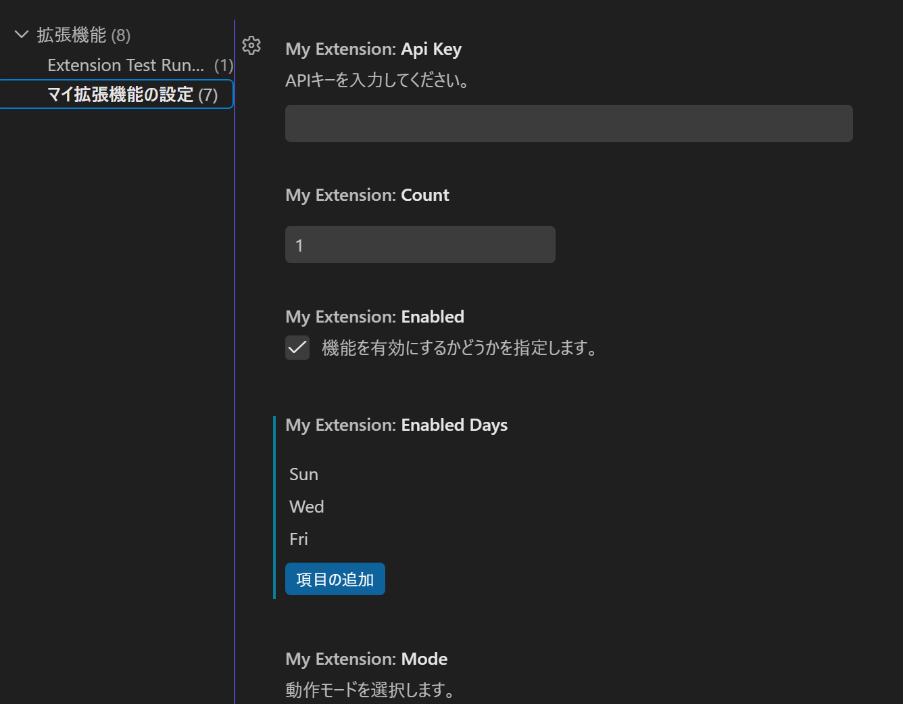

## VSCode設定の拡張機能開発

本稿では、以下のような設定画面を作れることをゴールとします。


---

## package.json

一番簡素なやり方は、`package.json`をルートに置くだけの開発です。

```json
// package.json
{
  "name": "vscode-extension-static-ui-sample",
  "displayName": "vscode-extension-static-ui-sample",
  "description": "",
  "version": "0.0.1",
  "engines": {
    "vscode": "^1.140.0"
  },
  "categories": [
    "Other"
  ],
  "activationEvents": [],
  "contributes": {
    "configuration": {
        // ここに設定項目を書いていく
    }
  },
  "scripts": {},
  "overrides": {
    "diff": "^8.0.4",
    "serialize-javascript": "^7.0.6"
  }
}
```

### i. プロパッティを定義

`contributes.configuration`に、以下の形式で設定を書いていくことができます。

```json
"contributes": {
  "configuration": {
    "type": "object",
    "title": "マイ拡張機能の設定",
    "preLaunchTask": null,
    "properties": {
      "myExtension.enabled": {},
      "myExtension.mode": {}
    }
  }
}
```


### ii. プロパッティの設定を定義

`property`を作ったら、実際に設定を作っていきます。
以下のような項目があります。

| 項目 | 意味 |
| --- | --- |
| type | 設定値のデータ型 |
| default | 初期値（ユーザーが未設定の場合に適用される値）|
| description | 設定画面や入力補完（IntelliSense）のホバー時に表示される解説文 |
| enum | 選択式（ドロップダウン）にする場合の許可される値の配列 |
| enumDescriptions | enum の各値に対する個別の説明文 |
| scope | 設定の適用範囲（application, machine, window, resource, machine-overridable など） |


例えば、以下のように設定項目を定義します。

```json
...
"properties": {
    "myExtension.enabled": {
        "type": "boolean",
        "default": true,
        "description": "機能を有効にするかどうかを指定します。"
    },
    "myExtension.mode": {
        "type": "string",
        "default": "fast",
        "enum": ["fast", "slow", "auto"],
        "enumDescriptions": [
            "高速モードで動作します",
            "低速モードで動作します",
            "自動で切り替えます"
        ],
        "description": "動作モードを選択します。"
    }
}
...
```

すると、以下のような設定が完成します。



---

## typeと設定画面のUI

`type`とUIの対応関係については以下の通りです。

| type | UI | 備考 |
| --- | --- | --- |
| string |  | - |
| number |  | 不動小数点を認める |
| integer |  | 小数を認めない |
| boolean |  | - |
| null |  | 明示的に値がないことを示す |
|||
| array |  | 上記の型を元に配列を作る |
|||
| object |  | `"properties"`で項目を定義して使う |


## Union Type

`type`に配列を当てると、Union Type が使えます。
Union Type は、複数の型を許可します。

```json
"myExtension.timeout": {
  "type": ["number", "null"],
  "default": null,
  "description": "タイムアウト秒数を指定します（未設定の場合は無制限）。"
}
```
